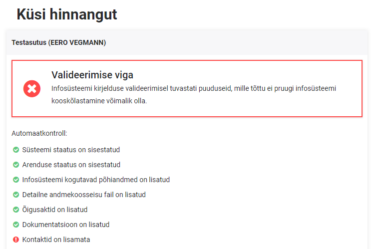
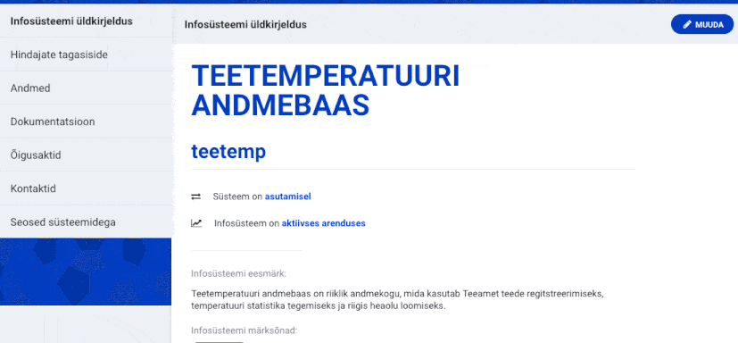
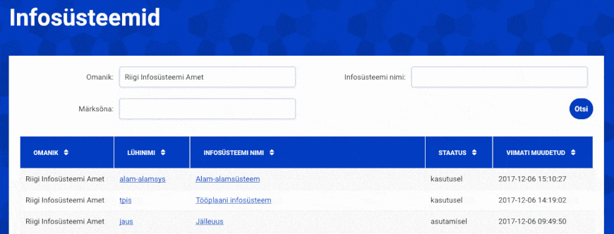

## 28. jaanuar 2019

### Mobiil-IDga autentimine

RIHAs võeti kasutusele [autentimisteenus TARA](https://www.ria.ee/et/riigi-infosusteem/eid/partnerile.html#tara). See tähendab, et lisaks ID-kaardile saab nüüd RIHAsse siseneda ka mobiil-IDga. Pärast edukat sisenemist antakse isikutele, kes pole RIHAs seotud ühegi asutusega, otseviide [asjakohasele juhendile](RIHA-oigused-haldamine), mis selgitab mida tuleb teha selleks, et RIHAs kirjeldama hakata.

### Kasutatavad klassifikaatorid ja turvaklass

Vanast RIHAst kanti üle infosüsteemis kasutatavate klassifikaatorite andmed: nimetus ja viide vanasse RIHAsse. Neid andmeid näidatakse infosüsteemi kirjelduses, jaotises "Dokumentatsioon". Lühinimede põhjal kanti vanast RIHAst üle ka infosüsteemide (v. a X-tee alamsüsteemide) turvaklassid (KTS), kui infosüsteemi omanik polnud neid juba ise uuesti sisestanud.

### Automaatkontroll hinnangu küsimisel

Infosüsteemile hinnangu küsimisel kontrollib RIHA sisestatud andmeid ja annab ülevaate, kas kooskõlastamiseks vajalikud väljad on täidetud ja millised puudused võivad kooskõlastamist takistada (nt kontaktisikud on lisamata).

### Failide ja viidete lisamise aeg

Infosüsteemide kirjelduses näidatakse nüüd ka failide ja viidete lisamise ning uuendamise kuupäeva.

### Ülevaade aruteludest

Nüüdsest näeb infosüsteemi omanik asutuse infosüsteemide ülevaate juures ka [nimekirja nende infosüsteemidega seotud aruteludest](https://www.riha.ee/MinuInfosüsteemid/Arutelud). Nimekirjas näidatakse peale infosüsteemi nime, lühinime ja arutelu pealkirja ka viimase kommentaari lisaja nime, asutust ning lisamise aega. Arutelusse kommentaari lisamiseks tuleb klikkida arutelu pealkirjal.

### Otsing infosüsteemis töödeldavatest andmetest

Lisati [andmeobjektide otsing](https://www.riha.ee/Andmeobjektid), mis võimaldab otsida andmekoosseisude failidest. Otsing sooritatakse sellistest failidest, mis on csv-, xls- ning xlsx-vormingus. Tulemustes näidatakse infosüsteemi nime, lühinime ja omanikku ning andmekoosseisu sisaldava faili nime, millel klikkides saab faili alla laadida.

## 27. märts 2018

### Turvainfo lisamine

RIHAs saab nüüd ka kirjeldada infosüsteemi turvameetmete rakendatust. Lisaks ISKE tasemele on võimalik RIHAsse lisada ka viimase auditeerimise kuupäev ning otsus. Auditeerimise info ei ole avalik - seda näevad vaid infosüsteemi omanik ja RIHA hindajad.

### Juurdepääsupiirang

Kui infosüsteemi dokumentatsioon sisaldab asutusesiseseks kasutamiseks mõeldud infot, siis on võimalik nendele dokumentidele lisada piirang ka RIHAsse - juurdepääsupiiranguga faile saavad avada ainult infosüsteemi omanik ja RIHA hindajad. Pane tähele - piirangut tohib RIHAs lisada vaid nendele dokumentidele, millele on AK märge tehtud. Seetõttu on vaja piirangu lisamisel märkida ka piirangu alus.

### Hindajate töölaud

Et RIHA hindajatel oleks hõlpsam leida kooskõlastamiseks esitatud infosüsteeme ja aktiivseid arutelusid, on nüüdsest RIHA hindajatel eraldi menüü 'Hinda', millelt avaneb töölaud. Töölaual näeb RIHA hindaja neid infosüsteeme, mis on esitatud kooskõlastamiseks, aga pole veel hindajaga seotud asutuselt hinnangut saanud. Lisaks kooskõlastamisele esitatud infosüsteemidele saab töölaualt ka vaate nendest aruteludest, kus on hindaja või temaga seotud asutus sõna võtnud (algatanud arutelu või kommenteerinud).

### Parem kommentaaride vormindamine

Tihti on hindajate kommentaarid arutelude all pikad ning sisaldavad ka veebiviiteid. Nüüdsest saab veebiviiteid ja reavahetusi kommentaarides julgelt kasutada, sest need on ka RIHA poolt toetatud.

### Kooskõlastamise etapi kontroll

Kooskõlastamiseks esitamisel toimub nüüd kontroll ning infosüsteemi omanikul ei ole võimalik esitada infosüsteemi sellisele kooskõlastamise etapile, mis on juba aktiivse aruteluna üleval.

### Uuenenud teavitus

Kui kasutajaga seotud arutelusse lisatakse uus kommentaar, siis nüüdsest saadab RIHA selle kohta täpsema teavituse. Teavituses on näha uue kommentaari lisanud asutus ja kommentaari sisu. Lisaks on võimalik teavitusest liikuda RIHAsse arutelu detailvaatesse, klikkides arutelu pealkirjale.

### Veebisirvija vahelehel näidatakse lehekülje pealkirja

Nüüdsest näeb veebisirvija vahelehel vastavalt külastatavale leheküljele ka pealkirja, mis hõlbustab kindlasti nende kasutajate tööd, kes on harjunud RIHA kasutama mitmel vahelehel või aknas.

## 30. jaanuar 2018 

### Täiustatud otsing

RIHA võimaldab nüüd üldotsingut teostada igal RIHA lehel kasutades selleks lehe peanavigatsioonis asuvat otsingukasti. Üldotsing otsib andmeid kogu infosüsteemi kirjelduse väljadelt: infosüsteemi üldkirjelduse väljad nagu eesmärk, märksõnad, omanik (nii nimi kui registrikood), lühinimi ja nimi, staatus, avalik veebileht. Lisaks otsitakse ka infosüsteemi andmete plokis asuvatest põhiandmete objektidest ja dokumentide nimedest, tehnilise kirjelduse plokis asuvate dokumentide nimedest ja URLidest ning õigusaktide plokis asuvate õigusaktide nimedest ja veebilinkidest.

Lisaks üldotsingule on RIHAs ka detailne otsing, mis pakub laia valikut otsingukriteeriume: näiteks otsida infosüsteeme, mida on muudetud teatud ajavahemikus; otsida infosüsteeme, mis on teatud staatusega jne. Erinevaid otsingukriteeriume on võimalik ka koos kasutada.

### Pärast sisselogimist samalt lehelt jätkamine

RIHA võimaldab pärast sisselogimist või asutuse rolli vahetust jätkata samalt lehelt. Nii ei pea pärast sisse logimist uuesti vaadeldavat infosüsteemi üles otsima või ise veebisirvijas 'tagasi' nuppu vajutama.

### RIHA laadimine 2 korda kiiremini

Et kasutajad ei peaks RIHA avamisel liialt palju ootama, on rakendust optimeeritud ja seega avaneb RIHA leht kaks korda kiiremini kui varem. Lisaks väheneb ka veebilehitseja koormus võrreldes varasema versiooniga, mistõttu on RIHA kasutamine mitmel vahelehel korraga märksa kiirem.

### Standardlahenduse seose tüüp

Oleme lisanud RIHAsse ka uue seose tüübi: kasutatav standardlahendus / standardlahenduse kasutaja. Lisaks on üle toodud standardlahenduse kasutamise seosed vanast RIHAst.
Uut tüüpi saab kasutada selleks, et märkida need infosüsteemid ja andmekogud, mis on standardlahenduse kasutajad ja ka vastupidi: märkida see standardlahendus, millel kirjeldatav süsteem põhineb.

### Kooskõlastamise staatus

RIHA näitab kataloogis välja infosüsteemi kooskõlastamise staatust vastavalt sellele, millisele etapile on positiivne otsus kõige viimasena saadud. Infosüsteemi detailvaates kuvatakse infosüsteemi staatuse juures, kas see etapp on saanud ka kooskõlastuse. Näiteks kui infosüsteem on kasutusel, kuid kasutusele võtmise kooskõlastamist positiivselt läbitud ei ole, siis kuvatakse seda punaselt.
Kui kooskõlastus on saadud vastavalt infosüsteemi staatusele, siis kuvatakse seda roheliselt ning näidatakse ka kuupäeva, millal selle etapi kooskõlastamine saadi.

### RIHA hindajate otsused sündmustena

RIHA hindajate otsuseid näidatakse arutelude all nüüd sündmustena. See võimaldab kiiret ülevaadet, millise otsuse asutused on andnud.

### Vanade kooskõlastamiste ületoomine 

Uude RIHAsse on nüüd üle toodud ka kooskõlastamiste otsused vanast RIHAst. See võimaldab nii infosüsteemi omanikul kui ka RIHA hindajal vaadata ajaloos tagasi ja näha, milliseid otsuseid ja kommentaare on infosüsteemi kooskõlastamisel varasemalt lisatud.
**Üle on toodud vaid kooskõlastamised, infosüsteemide registreerimise otsused (näiteks standardlahenduse kasutamise registreerimised) ei ole uude RIHAsse üle kantud.**
Need infosüsteemid, mis kooskõlastati kasutusele võtmiseks Andmekogude riiklikus registris (ARR) enne RIHA, omavad kooskõlastamise kuupäevana infosüsteemi kasutusele võtmise kuupäeva.

### Hindajate tagasiside täiendused

Hindajate tagasiside plokis on nüüd võimalus vaadata ka kõiki arutelusid ühes nimekirjas. Lisaks on nimekirjas näha ka arutelu tekitamise aeg, nimekiri ise on sorteeritud nii, et kõige värskemad arutelud on eespool.

### Otsingu parameetrid URLis on täienenud

Sooritades otsingu RIHA kataloogist, kuvatakse ka veebilehitseja URLi väljal parameetreid, millega otsingu sooritasid. URL sisaldab nüüd kõiki neid filtreid, mida täiustatud otsing võimaldab ning sisaldab infot ka sorteerimise ja lehekülje numbri kohta. Seega, kui soovid jagada kolleegiga otsingu tulemust, mis on sorteeritud näiteks omaniku nime alusel kahanevalt ning tahad viidata konkreetselt viiendale leheküljele, siis lihtne kopeeri-kleebi ajabki asja ära.

### Infosüsteemi kirjeldus UUID alusel

Kuigi infosüsteemi lühinimi on hea viis, et infosüsteemidele viidata, võib juhtuda, et infosüsteemi lühinime ajas muudetakse. Selleks, et ikka sama infosüsteem RIHAst üles leida, saab kasutada URLi, milles lühinimi on asendatud konkreetse infosüsteemi UUID-ga (*Universally unique identifier*), näiteks [riha.ee/Infosüsteemid/Vaata/f02f1ecd-9662-eedc-c9e2-d2cfd71a0606](https://www.riha.ee/Infosüsteemid/Vaata/f02f1ecd-9662-eedc-c9e2-d2cfd71a0606). Infosüsteemi UUID-d on võimalik vaadata infosüsteemi masinkirjeldusest (JSON struktuurist). 

### RIHA API uuendused

RIHA masinliides võimaldab nüüd saada infot infosüsteemide aruteludest terve RIHA üleselt. Teenus /issues tagastab nimekirja aruteludest, mis RIHAs on tekitatud ning võimaldab nimekirja erinevate parameetrite abil filtreerida. Teenusega on võimalik otsida näiteks kõik arutelud, mis parasjagu on aktiivsed; filtreerida välja ainult need, kus infosüsteem on esitatud kooskõlastamiseks; või otsida neid arutelusid, mis on loodud infosüsteemi kasutusele võtmise kooskõlastamiseks ja on lõppenud negatiivse tulemusega.
Täpsemat infot teenusest leiab [RIHA masinliidese kirjeldusest](https://github.com/e-gov/RIHA-Browser/blob/master/backend/src/main/resources/static/swagger.yaml)

## 7. detsember 2017 

### Infosüsteemide seosed

Infosüsteemide vahel on võimalik seoseid lisada, et tuua välja infosüsteemi ülem- ja alamsüsteemid. Funktsionaalsus võimaldab lisada seose näiteks andmekogu ning selle teenuseid vahendava X-tee alamsüsteemi vahel.
Seose lisamisel tekib infosüsteemidele link, millele vajutades saab otse vastava infosüsteemi detailvaatesse liikuda. Seose eemaldamisel kaob see link mõlema infosüsteemi kirjeldusest.

  

Enne 1. novembrit olnud infosüsteemide seosed on samuti vanast RIHAst uude üle kantud - neid käsitsi lisada pole vaja.

### Märksõnade alusel otsimine

Lisandunud on otsingu sooritamine märksõna alusel, mis võimaldab kiirelt üles leida näiteks kõik X-tee alamsüsteemid sisestades otsingusõnaks 'X-tee alamsüsteem'

Lisaks on võimalik infosüsteemide detailvaates ka märksõnale klikkida, mille järel sooritatakse RIHA kataloogist vastava märksõnaga otsing.

  

### Otsingu parameetrid on nähtavad URLis

Otsingu parameetrid on nüüd nähtavad ka URLis, mis võimaldab otsingut jagada näiteks enda kolleegiga, kes saab lingile liikudes sooritada kiirelt sama otsingu.

### Infosüsteemile hinnangu küsimine

Kui infosüsteemi omanik on kirjeldamise lõpetanud ning soovib sellele saada kooskõlastust, siis saab ta seda hindajate tagasiside plokis teha. Kasutajal on võimalik valida, millises infosüsteemi etapis kooskõlastust on vaja ning arutelu salvestamisel jõuab vastav soov kõigi RIHA hindajate postkasti.

Kooskõlastamise algatamise arutelusid saavad sulgeda ainult Riigi Infosüsteemi Ameti hindajad. Täpsem info kooskõlastamiste ja RIHA arutelude kohta leiab [RIHA hindamise abiinfost](RIHAs-hindamine).

### Meiliteavitused uutest aruteludest ja kommentaaridest

Kui infosüsteemile lisatakse hindajate tagasiside plokki uus arutelu, siis saadetakse kõigile infosüsteemi RIHAs olevatele kontaktidele selle kohta teavitus.
Kui ühtegi kontakti pole infosüsteemile lisatud, siis teavitusi välja ei saadeta.

Kui infosüsteemi omanik küsib RIHA hindajatelt tagasisidet, siis saadetakse kõigile RIHA hindajatele selle kohta teavitus.

Kui arutelu alla lisatakse uusi kommentaare, siis saavad kõik arutelus osalejad (sh arutelu algataja) selle kohta teavituse.

### Sessiooni lõppemise teavitus

Kui kasutaja on hoidnud pikalt RIHA lehekülge lahti ilma selles toiminguid sooritamata, siis teavitatakse kasutajat 5 minutit enne sessiooni lõppu. Kuni sessiooni lõppemiseni on võimalik kasutajal valida, kas soovib RIHA kasutamist autenditult jätkata või mitte. Jätkamisel pikendatakse kasutaja sessiooni. Loobumisel logitakse kasutaja süsteemist välja.

Kui sessioon juba on lõppenud, siis logitakse kasutaja süsteemist automaatselt välja ning näidatakse ka sellekohast teavitust.

## 1. november 2017

Toimus uue RIHA keskkonna avaldamine. [Vaata ka videosalvestust RIHA infopäevast](https://www.youtube.com/watch?v=K9lLS-7hpGw).

Uue RIHA peamised erinevused vanast RIHAst on välja toodud [uue RIHA muutuste abiinfos](uus-riha).

Vanast RIHAs kanti üle sellised infosüsteemid, mis olid **sisestamisel, asutatud või kasutusel staatusega**. Juurdepääsupiiranguga infosüsteemide puhul kanti üle vaid avalik teave. Infosüsteemide andmetest viidi üle võimalikult palju infot ning osaliselt toimus ka konverteerimine nende uuele tähendusele. Üle viidi järgmised infosüsteemide andmed:

- Nimi
- Lühinimi
- Staatus
  - kasutusele võtmise kuupäev
    - **kui infosüsteemi kasutusele võtmise aeg oli vanas RIHAs täidetud, siis viidi see üle 'kasutusel' staatusega olenemata läbitud/läbimata kooskõlastustest**
- **Vastutav töötleja -> omanik**
  - registrikood
  - nimi
- Infosüsteemi eesmärk
- Infosüsteemi URL -> avalik kasutajaliides
- X-teega liidestumise staatus (vastavalt vana RIHA kategooriale 'liidestatud/liidestatakse x-teega')
  - liidestumise kuupäev
- Infosüsteemi RIHA kirje tekitamise aeg
- Infosüsteemi viimase muudatuse aeg
- **Viimase ebaõnnestunud kooskõlastusringi mittekooskõlastamise otsused ja kommentaarid -> Hindajate tagasiside**
- Andmekoosseisu jaotisesse **üles laaditud** juurdepääsupiiranguta **andmeobjektide fail**
  -  käsitsi tehtud andmekoosseisu muudatused uues RIHAs ei kajastu
- Tehnilise dokumentatsiooni jaotises olevad juurdepääsupiiranguta failid ja veebiviited
- Infosüsteemi alusdokumendid -> Õigusaktid
  - Õigusaktide nimetused
  - URLid
- Infosüsteemi kontaktid, kellele oli lisatud meiliaadress
