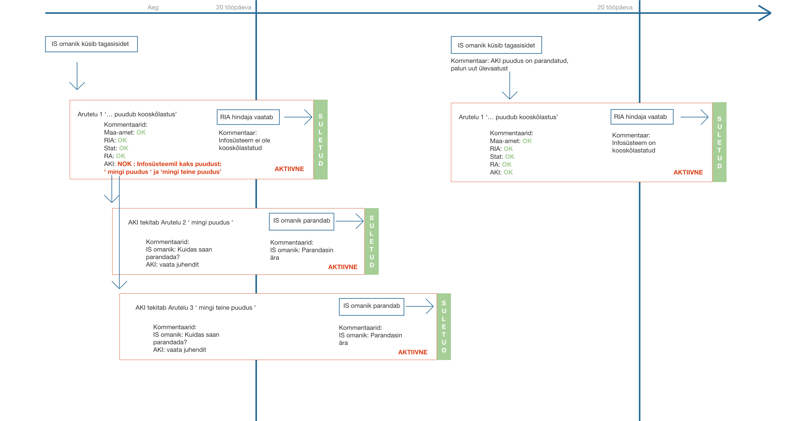
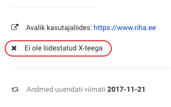
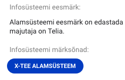
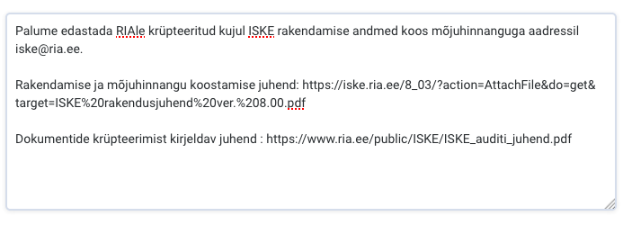
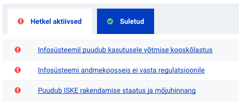

## Kuidas toimub uues RIHAs kooskõlastamine?

### Kooskõlastamiseks esitamine
- Infosüsteemi omanikud, kes soovivad kooskõlastust, lisavad enda infosüsteemi alla uue arutelu
  - Arutelu tekitamisel peab infosüsteemi omanik valima, millises etapis ta kooskõlastust soovib ning vastavalt valitule tekib arutelule ka sobiv pealkiri
- Pärast arutelu tekitamist saavad kõik RIHA hindajad enda meilile teavituse, kus on kirjas, milline infosüsteem kooskõlastust soovib
- Antud arutelu ei ole võimalik kasutajal ise sulgeda, seda **saab sulgeda ainult RIA hindaja**
  - Kui kõik hindajad on andnud positiivse kommentaari ja ühtegi muud aktiivset arutelu infosüsteemi all ei ole, siis lisab RIA hindaja **20 tööpäeva pärast arutelu algatamist** kommentaari, et infosüsteem on kooskõlastatud ja sulgeb antud arutelu. **Sellega loetakse infosüsteem kooskõlastatuks.**
  - Kui 20 tööpäeva möödudes on üleval aktiivseid arutelusid (ja hindaja on lisanud enda negatiivse hinnangu ka kooskõlastamise algatamise arutelusse), siis lisab RIA hindaja otsuse, et infosüsteem ei ole kooskõlastatud ja sulgeb antud arutelu. **Sellega loetakse infosüsteem mittekooskõlastatuks.**

### Kui kooskõlastust esimese korraga ei saa
Kui infosüsteem ei saa esimese korraga kooskõlastust, siis jäävad aktuaalsed probleemid aruteludena aktiivseteks. Infosüsteemi omanik peab esmalt kirjeldatud puudused parandama ja seejärel infosüsteemi uuesti kooskõlastamisele esitama.
- Kui puudused on parandatud ning vastavad arutelud suletud, siis lisab infosüsteemi omanik uue arutelu valides sobiva kooskõlastamise etapi.
- Kooskõlastajad vaatavad taaskord kirjelduse üle
- Kui puudused on kõrvaldatud, siis lisatakse arutelu alla positiivne kommentaar.
- Pärast kõiki positiivseid otsuseid lisab RIA hindaja koondotsuse ja sulgeb arutelu. Sellega loetakse infosüsteem kooskõlastatuks.

## Kuidas anda hinnangut uues RIHAs?

Pärast teavituse saamist vaata RIHAst, kas infosüsteem vajab sinu kooskõlastust.
**Ära lisa hinnangut:**
- **kui infosüsteem ei kuulu riigi infosüsteemi ehk pole X-teega liidestatud**
  - X-tee liidestamise staatuses on kirjas, et pole X-teega liidestatud (sellel väljal näidatakse ka kavatsust) 

  

- **kui infosüsteemile on lisatud märksõna 'X-tee alamsüsteem'**

  

Need infosüsteemid läbivad RIHAs ainult registreerimise, mida teostab RIA hindaja.

### Kooskõlastuse andmine

Kui infosüsteem on üle vaadatud ning ühtegi puudust pole tuvastatud, siis lisa kasutaja poolt tekitatud arutelu alla enda kommentaar ("Kooskõlastan").
- Kasutajad ootavad otsust 20 tööpäeva jooksul. **RIHA rakendus selle tähtaja lõppemisel hindajatele meeldetuletusi ei saada.**
- Kui soovid kooskõlastada märkustega, siis lisa enda kommentaarid samuti sama arutelu alla.

### Mittekooskõlastamine

Kui infosüsteemi üle vaatamisel selgus, et selles on nõuetele mittevastavusi, siis kirjelda **kõik puudused eraldi** aruteludena ning mittekooskõlastamise otsuse andmisel lisa ka peamise arutelu alla millised puudused tuvastasid (sinu tekitatud arutelude pealkirjad).

- Vali _**Lisa uus arutelu**_
- Lisa probleemi kokkuvõttev ja selge pealkiri
  - Pealkiri on kõikidele kasutajatele nähtav ning seetõttu peaks võtma üldisel tasemel kokku probleemi olemuse.
- Lisa probleemi detailsemalt kirjeldav kommentaar
  - Kommentaaris kirjelda võimalikult täpselt, milles on probleem: kui tegemist on veaga RIHAs olevas kirjelduses/dokumendis, siis anna selle kohta viide. Kui viga on õigusaktis, siis anna selle kohta viide.
  - Lisa võimalusel juhendi viide, mille alusel peaks kasutaja probleemi parandama

  

- _**Salvesta**_

Kui puuduseid on mitmeid, siis lisa need eraldi, et kasutajal oleks võimalik neid otsast peale lahendama hakata ning järk-järgult kõik puudused kõrvaldada.
Eraldi aruteludeks koondamine annab parema ülevaate, kui kaugele on infosüsteemi omanik probleemide lahendamisega jõudnud.

Kui infosüsteemi kirjeldusest on infot puudu, mis takistab täieliku ülevaate saamist, siis lisa see samuti eraldi aruteluna, et kasutaja saaks aru, millist infot on vaja tal veel RIHAsse üles panna.

Sinu poolt lisatud uusi arutelusid on võimalik sulgeda nii infosüsteemi omanikul (kui probleem saab lahendatud) kui ka kõigil kooskõlastajatel.
Sulge arutelu ise siis, kui kasutaja kommenteerib, et on vea parandanud ning oled omalt poolt selle üle kontrollinud, kuid kasutaja pole seda arutelu ise sulgenud.
Kõik, kes arutelus osalevad, saavad RIHAst teavituse, kui uusi kommentaare on lisatud.

## Mille alusel saab aru, kas infosüsteemi kasutusele võtmine on kooskõlastatud?

Kooskõlastatuks loetakse sellist infosüsteemi, mille suletud arutelude all on teema pealkirjaga 'Infosüsteemil puudub kasutusele võtmise kooskõlastus', mille tüübiks on _Infosüsteemi kasutusele võtmine_ ning selle viimaseks kommentaariks enne sulgemist on RIA kirjutanud **infosüsteemi kasutusele võtmine on kooskõlastatud**.

