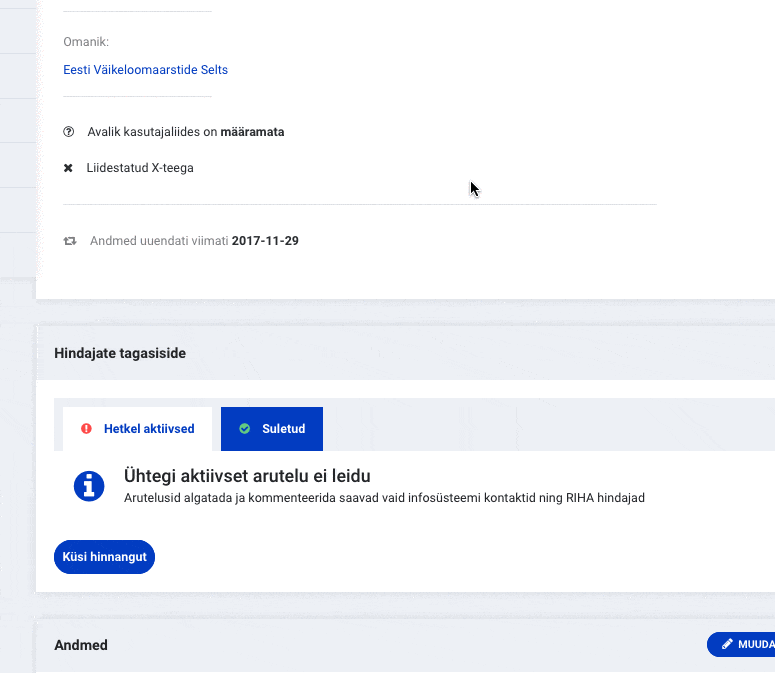
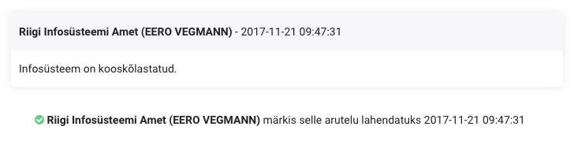

## Miks infosüsteeme kooskõlastatakse?

Riigi infosüsteemile ning selles osutatavatele teenustele kohalduvad koosvõimet, isikuandmete kaitset, statistika tootmist, arhiivindust, ruumiandmete töötlust jm toetavad ja tagavad nõuded ning regulatsioonid. Et nõuete täitmist kontrollida, läbivad infosüsteemid elukaare peamistes etappides kooskõlastusmenetluse.

## Kes infosüsteeme kooskõlastavad?

Infosüsteeme kooskõlastavad Riigi Infosüsteemi Amet (RIA), Andmekaitse Inspektsioon (AKI), Maa-amet ja Statistikaamet. Arhiiviväärtuslikke infosüsteeme kooskõlastab ka Rahvusarhiiv.
Arutelu detailvaates on näha ka konkreetne isik, kes kommentaari või hinnangu on andnud.

## Millal infosüsteeme kooskõlastatakse?

Infosüsteeme, mis on andmekogud, kooskõlastatakse:
- enne asutamist
- enne kasutusele võttu
- enne andmekoosseisu muutmist
- enne lõpetamist

## Kuidas toimub uues RIHAs kooskõlastamine?

RIHAs antakse kooskõlastusi hinnangutena, mis koondatakse aruteludeks. Aruteludes saab küsida täpsemat nõu kooskõlastajalt või vastata konkreetsele küsimusele, mis kooskõlastajal tekkis. Arutelude kommentaarid on nähtavad infosüsteemi omanikule ning kõigile RIHA hindajatele, avalikust vaatest need nähtavad ei ole. RIHA arutelu tohib sulgeda vaid siis kui probleem saab infosüsteemis lahendatud.

### Infosüsteemi kooskõlastamiseks esitamine

Kui infosüsteemi kirjeldamine on viidud lõpuni ning oled valmis seda kooskõlastamiseks esitama, siis
- Liigu infosüsteemi **hindajate tagasiside** plokki
- Vajuta **küsi tagasisidet**
- Avanenud modaalaknas vali, millist kooskõlastust on andmekogule vaja
  - Pane tähele, et andmekogusid peab seaduse järgi kooskõlastama enne asutamist, enne kasutusele võttu, enne andmekoosseisu muutmist ning enne lõpetamist.
  - Kui oled jäänud hiljaks infosüsteemi RIHAsse kandmisega ning infosüsteem on juba kasutusel, siis on sul samuti võimalik tagantjärgi kasutusele võtmise kooskõlastust küsida. 
    - Infosüsteemi staatuseks märgi alati süsteemi reaalne olek, sõltumata kooskõlastuse puudumisest
- Lisa kommentaar ja **salvesta**
- Ka pärast arutelu loomist on võimalik infosüsteemi andmeid muuta, et pisivigu parandada. Vigade parandamiseks ei pea ootama, et kõik hindajad enda tagasiside ära annavad.
  - Kui oled midagi parandanud või muutnud, lisa selle kohta ka arutelu alla kommentaar, milles kirjeldad lühidalt, millised muudatused infosüsteemis või dokumentatsiooni tegid, et RIHA hindajad oleksid muudatusest teadlikud.

Kõik RIHA hindajad saavad uuest tagasiside küsimisest teavituse ning annavad hinnangu 20 tööpäeva jooksul.

- **Arutelu, millega küsisid kooskõlastust enda süsteemile, saab sulgeda ainult RIA hindaja, andes pärast 20 tööpäeva lõpliku otsuse: kas infosüsteem kooskõlastati või mitte**

Kõikidest kommentaaridest, mis arutelu alla lisatakse, saavad teavituse kõik kasutajad, kes arutelus osalevad (sh arutelu algataja).

### Mittekooskõlastamised
- Kui infosüsteemil on puuduseid, mille tõttu pole võimalik anda positiivset kooskõlastust, siis algatavad hindajad iga puuduse kohta eraldi arutelu.
  - Sul on võimalus küsida hindajalt täpsustusi, et probleemi lahendada. Kui oled probleemi lahendanud, siis sulge see arutelu.
- Kui 20 tööpäeva pärast kooskõlastuse küsimist on mõne puuduse kohta (hindaja) algatatud arutelu aktiivne, siis ei ole infosüsteem kooskõlastatud ja RIA hindaja lisab kooskõlastuse küsimise arutellu vastava kommentaari ning sulgeb selle arutelu. **Sellega loetakse infosüsteem mittekooskõlastatuks.** Puuduse kohta algatatud arutelu jääb avatuks (aktiivseks) kuni puudus on kõrvaldatud.

### Kooskõlastamised
- Positiivsed kooskõlastused antakse teada sinu poolt algatatud arutelu all.
- Kui kõik hindajad on andnud positiivse kommentaari ja ühtegi muud aktiivset arutelu infosüsteemi all ei ole, siis lisab RIA hindaja otsuse, et infosüsteem on kooskõlastatud ja sulgeb antud arutelu. **Sellega loetakse infosüsteem kooskõlastatuks.**

### Mida pean tegema, kui esimese korraga kooskõlastust ei saa?

Kui infosüsteem ei saa (esimese korraga) kooskõlastust, siis jäävad aktuaalsed probleemid aruteludena aktiivseteks. 

- Ava konkreetne probleem ning püüa sellest aru saada
- Kui jääd hätta, siis esita arutelu alla küsimus, et RIHA hindaja saaks sulle täpsustamiseks vastata
- Leia probleemile lahendus ning tee vastavalt muudatused kas RIHAs olevas kirjelduses, õiguslikes dokumentides või infosüsteemis endas.
- Kui oled probleemi lahendanud, siis lisa kommentaar, kuidas probleemi lahendasid ja sulge arutelu.
- Pärast probleemide lahendamist esita infosüsteem taaskord kooskõlastamisele.
- **Ära esita infosüsteemi uuesti kooskõlastamisele, kui eelnevad puudused ei ole parandatud!** 

### Kui kaua pean kooskõlastust ootama?

Kooskõlastamine toimub 20 tööpäeva jooksul

## Kes saavad arutelusid avada ja sulgeda?

Infosüsteemi omanikul on võimalik 
- küsida tagasisidet enda infosüsteemile, mille järel on RIHA hindajatel kohustus infosüsteem 20 tööpäeva jooksul üle vaadata.
- kõikide enda infosüsteemide arutelude alla kommentaare lisada
- märkida lahendatuks RIHA hindajate algatatud arutelusid, milles on esitatud infosüsteemi puuduseid

Infosüsteemi omanik ei saa lahendatuks märkida järgmisi arutelusid: _'Infosüsteemi asutamine'_, _'Infosüsteemi kasutusele võtmine'_, _'Andmekoosseisu muutmine'_ ja _'Infosüsteemi lõpetamine'_. Neid arutelusid märgib lahendatuks ainult RIA hindaja.

RIHA hindajatel on võimalik
- lisada kõikide infosüsteemide alla uusi arutelusid, et välja tuua infosüsteemi puuduseid
- sulgeda arutelusid, kui puudused on kõrvaldatud

Arutelusid _'Infosüsteemi asutamine'_, _'Infosüsteemi kasutusele võtmine'_, _'Andmekoosseisu muutmine'_ ja _'Infosüsteemi lõpetamine'_ saab lahendatuks märkida ainult RIA hindaja.

## Kust ma näen, milliseid hinnanguid on infosüsteemile antud?

- Kõik hinnangute pealkirjad on nähtavad ka avalikust vaatest
- Hinnangute arutelu on nähtav ainult infosüsteemi omanikule ning RIHA hindajatele
- Kui infosüsteemile on märgitud puuduseid, siis on need nähtavad kohe **hindajate tagasiside** plokis aktiivsete arutelude all
- Hetkel käimasolev asutamise, kasutusele võtmise, andmekoosseisu muutmise või infosüsteemi lõpetamise menetlus on samuti nähtav aktiivsete arutelude all. 20 tööpäeva möödudes märgitakse teema lahendatuks ning see ilmub suletud arutelude all.

## Kuidas saan aru, et minu infosüsteemi kasutusele võtmine on kooskõlastatud?

Kooskõlastatuks loetakse sellist infosüsteemi

- millel ei ole ühtegi aktiivset arutelu **JA**
- millel suletud arutelude all on teema pealkirjaga 'Infosüsteemil puudub kasutusele võtmise kooskõlastus', mille tüübiks on _Infosüsteemi kasutusele võtmine_ ning selle viimaseks kommentaariks enne sulgemist on kirjutatud, et **infosüsteem on kooskõlastatud**.

## Kas ma saan pärast kooskõlastamisele esitamist veel infosüsteemi andmetes parandusi teha?

Jah, ka pärast kooskõlastamisele esitamist on võimalik infosüsteemi andmetes muudatusi teha, et vigu parandada.
**Kui oled midagi parandanud või muutnud, lisa selle kohta ka kooskõlastamise algatamise arutellu kommentaar, et RIHA hindajad oleksid muudatusest teadlikud.**

