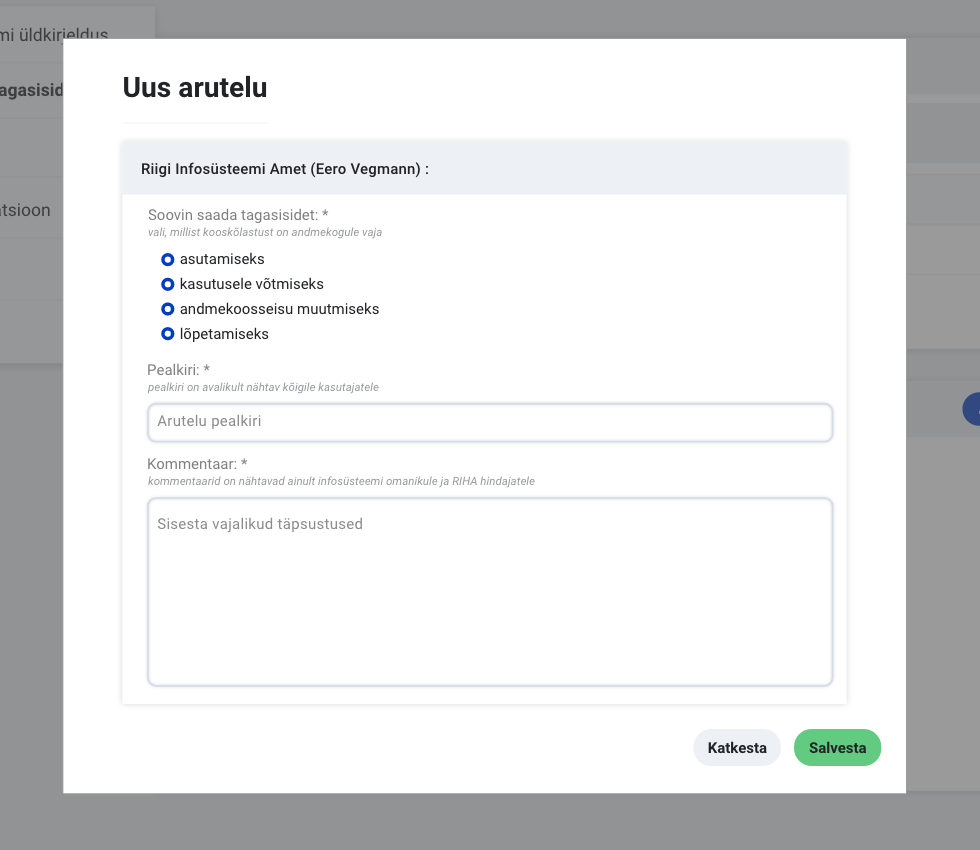
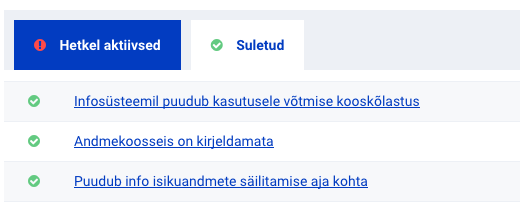

## Kuidas toimub uues RIHAs kooskõlastamine?

RIHAs antakse kooskõlastusi hinnangute näol, mis koondatakse aruteludeks.
Arutelule on võimalik vastata, et küsida täpsemat nõu kooskõlastajalt või vastata konkreetsele küsimusele, mis kooskõlastamisel tekkis. Arutelude kommentaarid ei ole avalikust vaatest nähtavad.

### Infosüsteemi kooskõlastamiseks esitamine

Kui infosüsteemi kirjeldamine on viidud lõpuni ning oled valmis seda kooskõlastamiseks esitama, siis
- Liigu infosüsteemi **hindajate tagasiside** plokki
- Vajuta **küsi tagasisidet**
- Avanenud modaalaknas vali, millist kooskõlastust on andmekogule vaja
  - Pane tähele, et andmekogusid peab seaduse järgi kooskõlastama enne asutamist, enne kasutusele võttu, enne andmekoosseisu muutmist ning enne lõpetamist.
  - Kui oled jäänud hiljaks infosüsteemi RIHAsse kandmisega ning infosüsteem on juba kasutusel, siis on sul samuti võimalik tagantjärgi kasutusele võtmise kooskõlastust küsida. 
    - Infosüsteemi staatuseks märgi alati süsteemi reaalne olek, sõltumata kooskõlastuse puudumisest
- Lisa kommentaar ja **salvesta**
- Ka pärast arutelu loomist on võimalik infosüsteemi andmeid muuta, et pisivigu parandada. Vigade parandamiseks ei pea ootama, et kõik hindajad enda tagasiside ära annavad.

Kõik RIHA hindajad saavad sellest teavituse ning vaatavad infosüsteemi kirjelduse üle 20 tööpäeva jooksul.

- **Kooskõlastamiseks esitatud arutelusid saavad sulgeda ainult RIA hindajad pärast menetluse lõppu**

### Mittekooskõlastamised
- Kui infosüsteemil on puuduseid, mille tõttu pole võimalik positiivset kooskõlastuse otsust anda, siis kirjeldavad hindajad need eraldi aruteludena.
  - Sul on võimalus küsida hindajalt täpsustusi, et probleemi lahendada
- Senikaua kuni probleemi ei ole kõrvaldatud, pole ka infosüsteem kooskõlastatud

### Kooskõlastamised
- Positiivsed kooskõlastused antakse teada sinu poolt algatatud arutelu all.
- Kui 20 tööpäeva jooksul on kõik hindajad andud positiivse otsuse, siis sulgeb arutelu lõpliku otsusega Riigi Infosüsteemi Ameti hindaja õigusega isik.

### Kui kaua pean kooskõlastust ootama?

Kooskõlastamine toimub 20 tööpäeva jooksul

## Kes saavad arutelusid avada ja sulgeda?

Infosüsteemi omanikul on võimalik 
- küsida tagasisidet enda infosüsteemile, mille järel on RIHA hindajatel kohustus infosüsteem 20 tööpäeva jooksul üle vaadata.
- kõikide enda infosüsteemide arutelude alla kommentaare lisada
- märkida lahendatuks arutelusid, mida on algatanud RIHA hindajad, et välja tuua infosüsteemi puuduseid
- Infosüsteemi omanik ei saa arutelusid tüüpidega 'Infosüsteemi asutamine', 'Infosüsteemi kasutusele võtmine', 'Andmekoosseisu muutmine' ja 'Infosüsteemi lõpetamine' ise lahendatuks märkida. Neid arutelusid märgib lahendatuks ainult Riigi Infosüsteemi Ameti hindaja õigusega isik.

RIHA hindajatel on võimalik
- lisada kõikide infosüsteemide alla uusi arutelusid, et välja tuua infosüsteemi puuduseid
- sulgeda arutelusid, kuid puudused on kõrvaldatud
- arutelusid tüüpidega 'Infosüsteemi asutamine', 'Infosüsteemi kasutusele võtmine', 'Andmekoosseisu muutmine' ja 'Infosüsteemi lõpetamine' saablahendatuks märkida ainult Riigi Infosüsteemi Ameti hindaja.

## Kust ma näen, milliseid hinnanguid on infosüsteemile antud?

- Kõik hinnangute pealkirjad on nähtavad ka avalikust vaatest
- Hinnangute arutelu on nähtav ainult infosüsteemi omanikule ning RIHA hindajatele
- Kui infosüsteemile on antud negatiivseid hinnanguid, siis on need nähtavad kohe **hindajate tagasiside** plokis aktiivsete arutelude all
- Hetkel käimasolev kooskõlastamiseks esitamine on samuti nähtav aktiivsete arutelude all. Kui kõik kooskõlastused on saadud, siis märgitakse see lahendatuks ning see ilmub suletud arutelude all.

## Kuidas saan aru, et minu infosüsteem on kooskõlastatud?

- Kui sinu infosüsteemi **suletud** arutelude all on 'Infosüsteemil puudub kasutusele võtmise kooskõlastus', millel on tüüp **Infosüsteemi kasutusele võtmine** ning ühtegi aktiivset arutelu ei ole, siis ongi infosüsteem kooskõlas ja kasutamiseks valmis

## Kas ma saan pärast kooskõlastamisele esitamist veel infosüsteemi andmetes parandusi teha?

Jah, ka pärast kooskõlastamisele esitamist on võimalik infosüsteemi andmetes muudatusi teha, et vigu parandada.

## Millal infosüsteeme kooskõlastatakse?

Infosüsteeme, mis on andmekogud, kooskõlastatakse:
- enne asutamist
- enne kasutusele võttu
- enne andmekoosseisu muutmist
- enne lõpetamist
