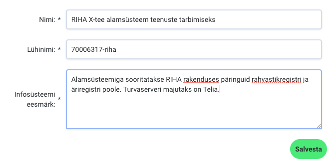

## Kuidas muuta X-tee alamsüsteemi andmeid RIHAs?

### Eeltegevused

- Mine [RIHA avalehele](https://www.riha.ee/)
- Logi sisse ID-kaardiga. Selleks vali paremalt ülalt "Logi sisse"
- Kontrolli paremalt ülalt, mis rollis oled. Valitud peaks olema asutus, mille alla soovid alamsüsteemi registreerida. Vajadusel vaheta enda rolli, vajutades üleval paremas nurgas enda nime peale.
  - kui sinuga pole seotud ühtegi asutust, vaata juhendit [siit](/RIHA-oigused-haldamine) 

### Uue alamsüsteemi kirjeldamine

- Vajuta avalehel X-teega liitumise kastis [Alustan](https://www.riha.ee/Kirjelda/Uus)
- Lisa uue alamsüsteemi andmed
  - Nimi – Mis alamsüsteemiga on tegu? (Nimetus võiks sisaldada sõna „X-tee alamsüsteem“)
  - Lühinimi – kujul *_asutuse registrikood – nimetus_* . Lühinimi võib sisaldada ainult ladina tähti (mitte täpitähti), numbreid, punkti ja miinusmärki. Nt. 12345678-riha.
  - Infosüsteemi eesmärk – Miks infosüsteem luuakse? Milliste infosüsteemidega on alamsüsteem seotud? Kes majutab turvaserverit?
  - Salvesta

  

Pärast salvestamist avaneb loodud alamsüsteemi detailvaade

- Pärast salvestamist on võimalik alamsüsteemi andmeid muuta. Näiteks valida uue lühinime, muuta eesmärki või alamsüsteemi nime.
- Kui mingil põhjusel sai valitud vale lühinimi, siis ei ole vaja alamsüsteemi registreerimist uuesti alustada, vaid tuleks muuta juba alustatud süsteemi andmeid.

### X-tee alamsüsteemi andmete muutmine

- Infosüsteemi märksõnade lahtrisse kirjuta: X-tee alamsüsteem
- Vali dokumentide paneeli ülaosast MUUDA ning vajadusel lisa tehnilise dokumentatsiooni viited
  - Eraõiguslik X-tee liige, kelle infosüsteem ei ole avaliku teabe seaduse tähenduses andmekogu ja kelle infosüsteemi ei kasutata avaliku teenuse osutamiseks, peab lisama dokumentide alla ettevõtte esindusõigusliku isiku digitaalselt allkirjastatud [Nõuetele vastavuse kinnituse](https://www.ria.ee/public/x_tee/xtee_nouetele_vastavus_kinnitus.pdf). Volitatud esindusõiguse puhul lisa digidoc konteinerisse enne dokumendi allkirjastamist juurde ka volikiri või lisa volikiri eraldi failina.
  - Kirjuta dokumendi nimi ja veebiviide või lisa dokument manusena > LISA > SALVESTA
- Vali kontaktide paneeli ülaosast MUUDA ning lisa vähemalt üks kontaktisik, kes vastutab alamsüsteemi toimimise eest
  - Kirjuta nimi ja email (mõlemad kohustuslikud) > LISA > SALVESTA
  - _Kontaktisikuid näevad vaid sisselogitud kasutajad_

### X-tee alamsüsteemide haldamine

- Kõik sinu asutuse poolt registreeritud alamsüsteemid ja infosüsteemid leiad [Minu infosüsteemide](https://www.riha.ee/Kirjelda) hulgast
- Alamsüsteemi muutmiseks ava selle detailvaade, vajutades nimekirjas süsteemi nimele või lühinimele 
- Alamsüsteemi üldandmete plokis on võimalik muuta näiteks infosüsteemi nime, lühinime või eesmärki. 
- Alamsüsteem on registreeritud RIHAs, kui sellel on märge "Süsteem on kasutusel" ja infosüsteemi märksõna on "X-tee alamsüsteem"
