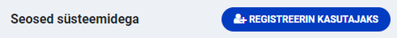

## Mis on standardlahendus?

Standardlahendus on RIHAs registreeritud tarkvaraline lahendus, mida asutusel on võimalik kasutada andmekogu pidamiseks. Suurem osa standardlahendusi on välja töötatud kohalike omavalitsuste vajaduste rahuldamiseks.

## Millised standardlahendused on RIHAs?

RIHAs registreeritud standardlahenduse tunneb ära spetsiaalse märksõna *standardlahendus* järgi: [https://www.riha.ee/Systems?topic=standardlahendus](https://www.riha.ee/Systems?topic=standardlahendus)

## Mida tähendab standardlahenduse kasutamise registreerimine?

Enne andmekoguna peetava infosüsteemi kasutusele võtmist tuleb see registreerida RIHAs. Selleks on kaks võimalust:

- Andmekogu dokumentatsioon kokku panna, esitada RIHAsse ja kooskõlastada kuni viie asutusega
- Registreerida andmekogu standardlahenduse kasutamisena

Teisisõnu, standardlahenduse kasutamise registreerimine tähendab andmekogu RIHAs registreerimise kohustuse täitmist.

## Kes peab registreerima standardlahenduse kasutamise?

Kuna RIHAs registreeritakse selliseid infosüsteeme, mis on andmekogud (ja nende andmekogudega seotud ning X-teega liidestatud muid infosüsteeme ja X-tee alamsüsteeme), siis standardlahenduse kasutamise peab registreerima juhul, kui standardlahendust kasutatakse avaliku teabe seaduse mõistes andmekogu pidamiseks.

_Näide: Eesti koolide haldamise infosüsteem (EKIS) on infosüsteem, mida ligi 500 haridusasutust kasutab mh dokumendiregistri pidamiseks. Dokumendiregister on asutustevaheliseks dokumentide menetlemiseks peetav andmekogu. Kool, kes kasutab EKISt dokumendiregistri pidamiseks, peab selle registreerima RIHAs. Kohutustuse saab täita, registeerides korrektselt standardlahenduse kasutamise._

## Kuidas registreerida standardlahenduse kasutamist?

Vajad [RIHA kirjeldaja õigust](https://abi.riha.ee/RIHA-oigused-haldamine), toimi järgmiselt:
- Ava [standardlahendusena registreeritud infosüsteem](https://www.riha.ee/Systems?topic=standardlahendus) ning plokis **Seosed süsteemidega** kliki nupul **Registreerin kasutajaks**

- Sisesta nimi (kasuta andmekogu põhimääruses märgitud nime), lühinimi, eesmärk ja kirjelda milliste erisustega standardlahendust kasutad (nt moodulite nimed, versioon jms) ja vajuta **Salvesta**

- Luuakse uue infosüsteemi kirjeldus, kuhu kopeeritakse osa andmeid ja dokumente standardlahenduselt ning lisatakse Sinu märgitud andmed
- Lisa kindlasti kontaktisikud (kellelt nt hindajad saavad vajadusel küsida sinu andmekogu kohta lisainfot), teave infoturbemeetmete rakendamisest, andmekogu pidamise põhimäärus ning staatus (_asutamisel_, _kasutusel_). Vajadusel muuda ka teisi andmeid.
