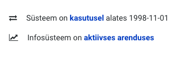
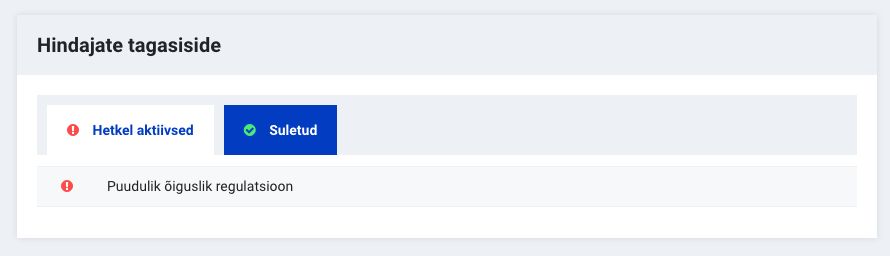
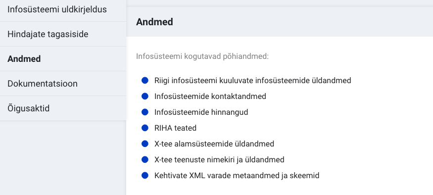

## Mida saab uues RIHAs teha?

Uues RIHAs saavad:
- kõik kasutajad infosüsteeme otsida ja vaadata
- infosüsteemi omanikud oma infosüsteeme kirjeldada (sh X-tee alamsüsteeme registreerida), muuta ning kooskõlastajatega suhelda
- kooskõlastajad infosüsteemidele tagasisidet anda

## Mis on uues RIHAs erinev kui vanas RIHAs?

### Infosüsteemi staatus

Infosüsteemide staatused ei kajastanud vanas RIHAs väga tihti infosüsteemi reaalset olekut: oli infosüsteeme, mis olid mitmeid aastaid kasutusel, kuid vana RIHA näitas staatust, milleni RIHAs infosüsteemiga jõutud oli, näiteks 'asutamine kooskõlastatud'. See ei kuvanud riigi infosüsteemist adekvaatset pilti.

- Uues RIHAs määrab kasutaja ise enda infosüsteemi reaalse oleku. Selleks on uues RIHAs kaks staatust: 'Süsteemi staatus' ja 'Arenduse staatus'. 
- Süsteemi staatused on asutamisel, kasutusel ja lõpetatud. See näitab süsteemi reaalset olekut ning on kasutaja poolt kergesti muudetav.
- Arendamise staatus on määratav jah/ei vormis: kas infosüsteem on aktiivses arenduses või infosüsteem ei ole arenduses. Staatus "aktiivses arenduses" väljendab seda, et infosüsteemi arendatakse aktiivselt ning lähitulevikus on oodata muudatusi ka RIHA kirjelduses (näiteks andmetes või tehnilises dokumentatsioonis).

### Kooskõlastamine

- Uues RIHAs ei ole võimalust kooskõlastajatel anda hinnangut 'kooskõlastan'. Selle asemel on uues kontseptsioonis kasutusel vastupidine funktsionaalsus.
- Kui infosüsteemil on puudusi, siis annavad kooskõlastajad sellest infosüsteemi juures teada, lisades uue arutelu, milles kirjeldatud puudused tuleb infosüsteemi omanikul kõrvaldada

- Hinnanguid saavad RIHA kooskõlastajad infosüsteemidele anda igal ajahetkel
- Iga infosüsteem on kooskõlastatud just nii kaua kuni ükski kooskõlastaja pole sellele aktiivset arutelu tekitanud
- Aktiivsete arutelude kõrval on võimalik vaadata ka suletud arutelusid, mis näitavad, millised infosüsteemi puudused on aja jooksul lahendatud

### Andmete koosseis

- Uues RIHAs on andmekoosseisu kirjeldamine tehtud vähem aeganõudvaks
- Käsitsi on infosüsteemi omanikul vaja kirjeldada kuni 10 objektiga, milliseid põhiandmeid infosüsteem sisaldab. See on kui äriline vaade, mis annab infosüsteemi uurivale kasutajale kohe ülevaate, millist infot infosüsteemis hoitakse.

- Lisaks ärilisele vaatele on võimalik üles laadida infosüsteemi detailset andmete koosseisu. See dokument on vaja esitada kas .csv või .xmi failina.
  - Faili struktuuri RIHA rakendus rangelt ei kontrolli, kuid sisaldama peaks see infot, millised andmed on põhiandmed, millised on tehnilised andmeväljad ning millised andmed küsitakse teistest infosüsteemidest
  - Üles laaditava dokumendi puhul soovitame kasutada struktuuri, mida olete ka vanas RIHAs andmekoosseisu üleslaadimisel kasutanud

## Mida ei ole enam RIHAs võimalik teha?

### Kooskõlastamiseks esitamine

Kuna kooskõlastajate poolt kontrollitavad nõuded kehtivad olenemata RIHAs kirjeldamise staatusest, siis:
- uues RIHAs ei toimu pärast infosüsteemi kirjeldamist selle kooskõlastamiseks esitamist. Kõik kooskõlastajad saavad automaatselt iga päev teavitusi uutest infosüsteemidest ning vaatavad kirjeldusi üle vastavalt oma asutuse sisemistele protsessidele.
- annavad kooskõlastajad infosüsteemi kirjelduses leitud puudustest teada lisades infosüsteemi alla uue arutelu, milles kirjeldatud puudused tuleb infosüsteemi omanikul kõrvaldada
- saab arutelusid tekitada igal ajahetkel. Ka siis, kui infosüsteem on juba ammu kasutusele võetud.

### Klassifikaatorid

[Klassifikaatorite süsteemi](https://www.riigiteataja.ee/akt/12910889) määrus ei vasta tegelikule olukorrale, kuna:
- senised Statistikaameti kooskõlastatud ja kehtestatud staatusega klassifikaatorid RIHAs on enamuses osas loendid. Loendid pole oma olemuselt klassifikaatorid, kuna on infosüsteemis kasutatavaid abivahendeid ning nende alusel ei toimu andmevahetus riigi infosüsteemi kuuluvate andmekogude vahel.
- vaid infosüsteemi seostamine klassifikaatoriga ei anna tegelikult infot, kuidas üle X-tee andmeid välja antakse ning süsteemi sees võib tegelikult andmeid ka endale sobival kujul klassifitseerida. Seetõttu oleks sobilikum siduda klassifikaatoreid pakutavate X-tee teenustega, mitte infosüsteemi või kogutavate andmeobjektidega
Senikaua kuni määrus ning RIHAs kajastuv seis ei ole kooskõlas (st loendid pole eemaldatud/reguleeritud), ei ole mõistlik klassifikaatorite osa uude RIHAsse üle kanda. Küll aga võib infosüsteemi omanik lisada klassifikaatorid vastava infosüsteemi dokumentatsiooni paneelis viidete/failide lisamisega.

### Sõnastikud

8 aastaga on registreeritud ainult 16 sõnastikku ja kirjeldatud 1105 terminit (võrdluseks, et RIHAs on kirjeldatud ligikaudu 85 000 andmeobjekti). Uues RIHAs sõnastikke ei ole, kuna sõnastike loomiseks ja kasutamiseks pole avalikus sektoris olnud piisavat motivatsiooni ja ressurssi. Seetõttu ei ole võimalik valdkondade sõnastikke:
  - vaadata
  - üles laadida
  - andmekoosseisuga siduda
Küll aga on võimalik piiratud aja jooksul tutvuda seniste sõnastike ja terminitega vanas RIHAs.

### X-tee teenused

- Uues RIHAs on ainult infosüsteemide ning X-tee alamsüsteemide kirjed, täpsemat infot X-tee teenuste kohta uus RIHAs ei ole
- Teenuseid otsida ning nende WSDL-e vaadata RIHA vahendusel ei saa
- Teenuste kirjeldusi inimloetaval kujul on võimalik lisada infosüsteemi dokumentatsiooni alla

X-tee alamsüsteemide teenuste ning WSDL-ide kuvamiseks tekitatakse X-tee kataloog, mis hakkab kuvama andmeid automatiseeritult. Nii ei ole vaja kasutajatel eraldi teenuste WSDL-e RIHAsse kirja panna või neid üles loetleda.

### X-tee sertifikaatide taotlemine

Kuna X-tee versioon 6-s ei väljasta sertifikaate RIA, vaid vastav seritifitseerimisteenuse osutaja, siis ei ole ka uues RIHAs sertifikaatide taotlemise funktsionaalsust realiseeritud.

### X-tee teenuse avamise taotlemine

- Et RIHAs puuduvad X-tee teenused, siis ei ole RIHAs ka funktsionaalsust, et esitada avaldus teenuste kasutamiseks
- Teenuse kasutamise lepivad kokku osapooled omavahel valides selleks kanaliks näiteks e-posti või muu klienditeeninduskanali
